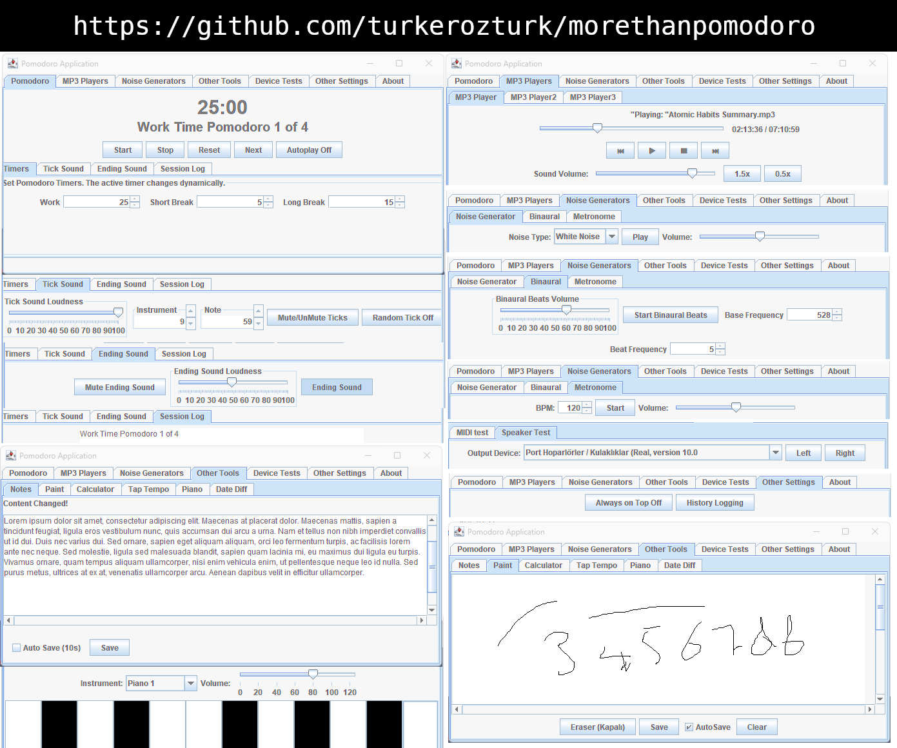

# morethanpomodoro

DISCLAIMER OF LIABILITY:
This software is provided "AS IS" without any warranties, expressed or implied, including but not limited to warranties of merchantability and fitness for a particular purpose. The authors and contributors shall not be liable for any damages or consequences arising from the use or misuse of this software.

Türker Öztürk 

LICENSE GPL-3.0

# Current Status of the Software

Use in an empty folder to avoid overwriting files named notes.png, notes.txt, playlist1.txt, playlist2.txt, and playlist3.txt.

This software is still under development and, while it is functional for my own use, it may have missing features or usability issues that could make it difficult for others to use effectively.

There is currently no detailed user guide, and some parts of the application may not be intuitive for first-time users. However, the overall design and interface seen in the current version are expected to remain largely the same in future updates.

The primary goal moving forward is to improve stability, fix bugs, and complete missing features to provide a more seamless experience. User feedback is always welcome, but please keep in mind that the software is still evolving.

### Direct Download

The EXE file is not native. Java 1.8 is required too.

https://github.com/turkerozturk/morethanpomodoro/releases/download/v1.0.0/morethanpomodoro20250210.exe

JAR file:

https://github.com/turkerozturk/morethanpomodoro/releases/download/v1.0.0/morethanpomodoro20250210.jar

### Release Notes

https://github.com/turkerozturk/morethanpomodoro/commits/v1.0.0

### Run the Application:

Open a terminal or command prompt and navigate to the directory where the JAR file is saved.
Run the following command:

java -jar morethanpomodoro20250210.jar

Project Duration:

(2025-02-03 - 2025-02-10)