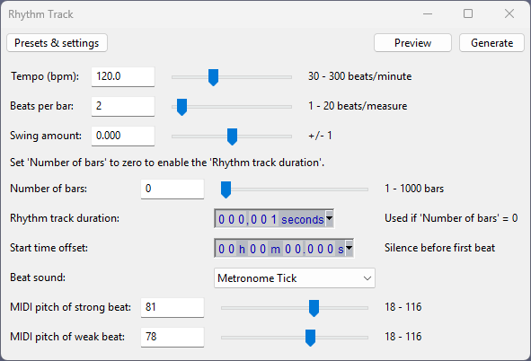

# morethanpomodoro

This software is still under development. 
Use it on an empty folder to prevent overwriting some files with the same name, if they exist.

Demonstration video:

Codes can change constantly. When compiled from source code, the application may not work. If anyone wants to try it, they can download the compiled file from the release page and try it. Although the compiled file contains many deficiencies and logical errors, it is in working order.

Developer: Türker Öztürk (with AI support)

LICENSE GPL-3.0

DISCLAIMER OF LIABILITY:
This software is provided "AS IS" without any warranties, expressed or implied, including but not limited to warranties of merchantability and fitness for a particular purpose. The authors and contributors shall not be liable for any damages or consequences arising from the use or misuse of this software.

## Third-Party Licenses

This project includes portions of code from third-party sources:

- **Musicplayer project** (https://github.com/Velliz/Musicplayer), licensed under the Apache License 2.0. (In my project, codes are inside mtp-sound-mp3-player-jlayer-ext module.)
    - Commit reference: [41c4c5ee21](https://github.com/Velliz/Musicplayer/commit/41c4c5ee21a21a845865c34c2b847c75d3349604)
    - Original author: Velliz
    - License file: [Apache License 2.0](http://www.apache.org/licenses/LICENSE-2.0)

- **MidiPiano project** (In my project, codes are inside mtp-sound-midipiano-ext module.)
- **Advanced Calculator project** (In my project, codes are inside mtp-advanced-calculator-ext module.)

# Current Status of the Software

Use in an empty folder to avoid overwriting files named notes.png, notes.txt, playlist1.txt, playlist2.txt, and playlist3.txt.

This software is still under development and, while it is functional for my own use, it may have missing features or usability issues that could make it difficult for others to use effectively.

There is currently no detailed user guide, and some parts of the application may not be intuitive for first-time users. However, the overall design and interface seen in the current version are expected to remain largely the same in future updates.

The primary goal moving forward is to improve stability, fix bugs, and complete missing features to provide a more seamless experience. User feedback is always welcome, but please keep in mind that the software is still evolving.

### Direct Download

[!IMPORTANT]
BUG FIX: You need to make pomodoro.timer.autoplay.is.enabled=0 in config.properties file. Open the software, create config.properties file from user interface, close the program, change the value from 1 to 0 in config file. Start the program. Then pomodoro timer will work correctly.

Use it in an empty folder! Because it can overwrite some files with the same name, if they exist.

The EXE file is not native. Java 1.8 is required too.

https://github.com/turkerozturk/morethanpomodoro/releases/download/v1.0.1/morethanpomodoro20250218.exe

JAR file:

https://github.com/turkerozturk/morethanpomodoro/releases/download/v1.0.1/morethanpomodoro20250218.jar

The EXE file is not native. Java 1.8 is required too.

https://github.com/turkerozturk/morethanpomodoro/releases/download/v1.0.0/morethanpomodoro20250210.exe

JAR file:

https://github.com/turkerozturk/morethanpomodoro/releases/download/v1.0.0/morethanpomodoro20250210.jar

### Running the Application Without Character Encoding Issues

Open a terminal or command prompt and navigate to the directory where the JAR file is saved.
Run the following command:

    java -Dfile.encoding=UTF-8 -jar morethanpomodoro20250210.jar

### Release Notes

https://github.com/turkerozturk/morethanpomodoro/commits/v1.0.0

### Screenshots

2025-02-24

2025-02-18

2025-02-15

2025-02-10

2025-02-16

The tick sound of the Pomodoro timer is generated by the Rhythm Track generator feature of the Audacity application. The screenshot contains the exact values of the generation settings.

## Icon sources:

https://github.com/OpusCapita/svg-icons
(Apache 2.0 license, OpusCapita svg icons)

https://github.com/tabler/tabler-icons
(MIT license, Tabler Icons)

https://iconduck.com/icons/183750/maximize-2
(MIT license, Iconsax Icon Set)

https://iconduck.com/emojis/98115/top-with-upwards-arrow-above
(MIT license, Twitter Emoji Twemoji Set)

## Project Duration:

(2025-02-03 - 2025-03-03)